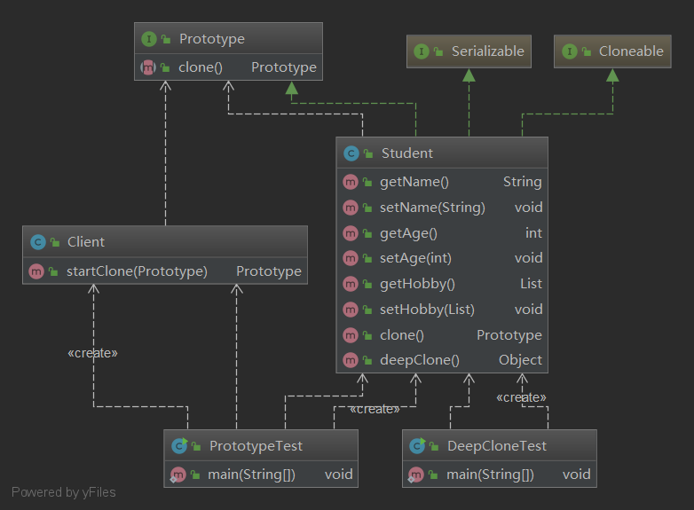

# 设计模式Demo

## 原型模式

原型模式就是用原型实例指定创建对象的种类，并且通过复制这些原型创建新的对象。

在原型模式中，所发动创建的对象通过请求原型对象来拷贝原型对象自己来实现创建过程，当然所发动创建的对象需要知道原型对象的类型。这里也就是说所发动创建的对象只需要知道原型对象的类型就可以获得更多的原型实例对象，至于这些原型对象时如何创建的根本不需要关心。

讲到原型模式了，我们就不得不区分两个概念：深拷贝、浅拷贝。

浅拷贝：使用一个已知实例对新创建实例的成员变量逐个赋值，这个方式被称为浅拷贝。

深拷贝：当一个类的拷贝构造方法，不仅要复制对象的所有非引用成员变量值，还要为引用类型的成员变量创建新的实例，并且初始化为形式参数实例值。

